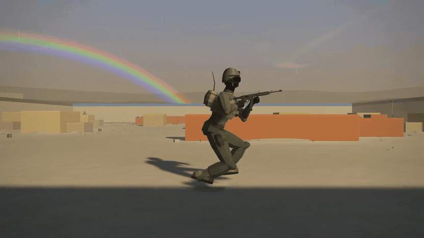
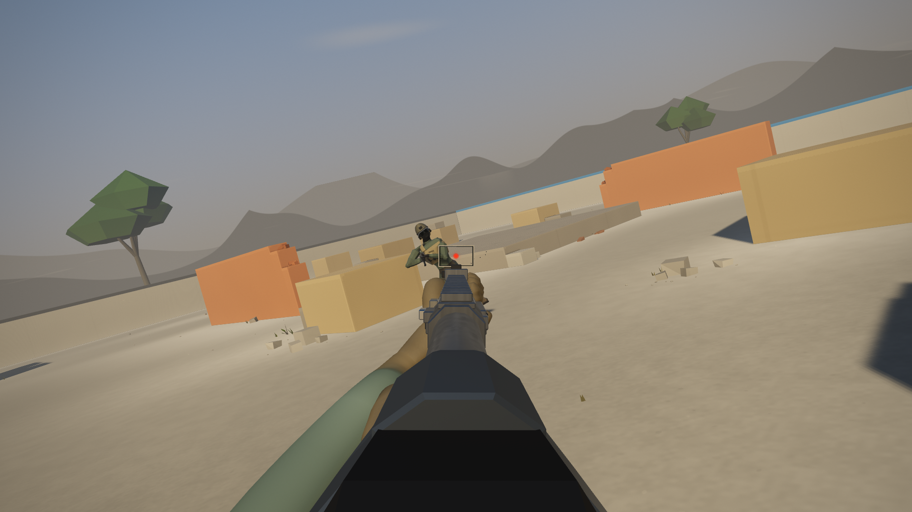
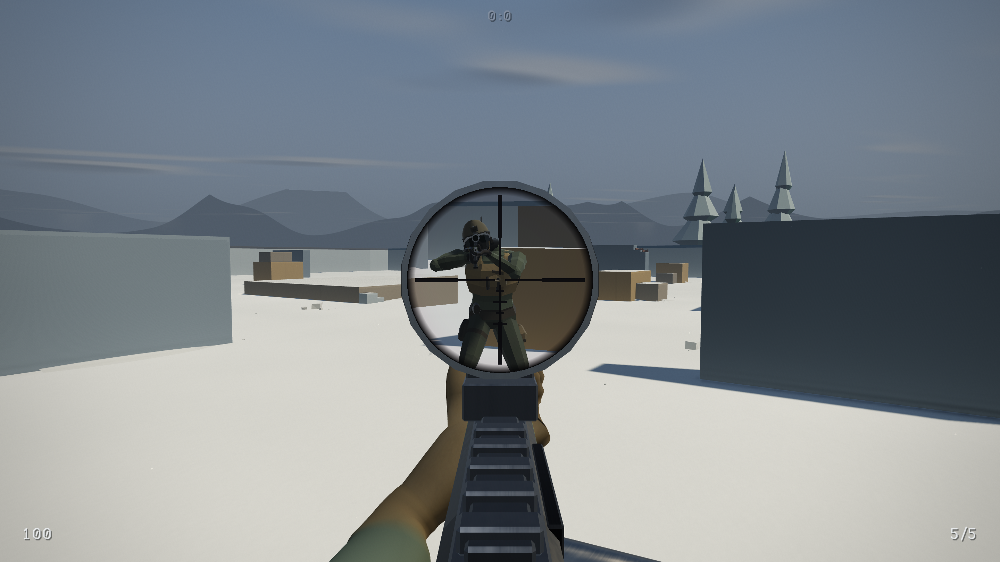

  

<h1 align="center">skill-issue</h1>

  <b>Free arena FPS. A new procedural map every match, two guns, 120 Hz servers. 
  No SBMM, no unlocks, no attachments. If you lose: skill issue.</b>

  <a href="https://github.com/codehamr/skill-issue/releases/latest/download/skill-issue-windows-amd64.exe"><b>Download for Windows</b></a>
  &nbsp;·&nbsp;
  <a href="https://github.com/codehamr/skill-issue/releases/latest/download/skill-issue-linux-amd64"><b>Linux / Steam Deck</b></a> 
  One file, just over a megabyte. No installer, no launcher, no account. 
  Windows will warn (new, unsigned): More info, then Run anyway. Linux: <code>chmod +x</code> it first.
  Details on the <a href="https://github.com/codehamr/skill-issue/releases/latest">release page</a>.

  
  

## The game

**A new arena every match.** The map is generated from a seed and thrown away when the
match ends, so nobody has map knowledge. Nothing ships as an asset either: the arena,
both weapons, the soldiers and every sound are built in code at startup instead of loaded
from a file. What carries over between matches is aim and movement.

**Two guns, everyone gets both.** An automatic rifle and a bolt sniper that kills with a
single body hit. Both are hitscan. No loadouts, no battle pass. Rounds cross up to 1.2 m
of material at *full* damage, so most cover in the arena is a timing problem rather than a
wall, and anything thicker still has corners. The arena's outer shell is the one thing
nothing goes through.

**Movement you can get good at.** Air control to carve a jump, a slide that carries real
speed out of a corner, `Q`/`E` lean to peek with your eye instead of your whole body.

**No SBMM. Ever.** Mixed lobbies. You will run into someone better than you. If you get
farmed, you got farmed. The title of the game is the diagnosis.

**Instant.** There is a live firefight behind the start screen while you read it. Two
presses, SINGLEPLAYER then START MATCH, and you are shooting, keyboard or pad. The bots
hear you, remember you and push, so it works solo too.

## Multiplayer

The dedicated server is the same file with graphics and sound stripped out, running the
same simulation at the full 120 Hz tick, with lag compensation that rewinds the world to
the tick you actually shot on. Up to 8 humans per arena, my own Quick Join box is set
lower while it is small, and bots fill the empty slots without ever being disguised as
humans: it is the humans the scoreboard badges, not the bots.

Quick Join lands on a small server I run and pay for myself, so no promises it stays
smooth if a crowd shows up. Which is fine: anyone can host with any Linux copy.

## Why this exists

Fun project by a single dev who grew up on Quake 3 and is done with SBMM, DLC and
microtransactions. I wanted to know how clean and fast a shooter decided by skill gets
when you drop all of that: no engine, no bloat, plain C compiled to one native executable
that runs fast on basically anything. If a real crowd forms and wants friend join and
stable servers, a fun Steam release is on the table. Until then: do not take my little
experiment too seriously, have fun with it.

## Usage ping

The game pings a server about once a minute, and this is the whole packet: an install id
(a number rolled from the clock when the game first ran and kept in `config.cfg`, not
anything about your machine), whether the ping is the first of the session or a later one,
which mode you are in, how many seconds have passed since the previous ping, Windows or
Linux, and on that first ping the build version. No name, no hardware details, no
addresses stored. It goes to the same host Quick Join dials, so if you point the game at
somebody else's server, that operator gets the id instead of me. `telemetry 0` in
`config.cfg` opts out.

## Updates

The game asks GitHub for a newer build at startup, and again when you open the menu. On
the start screen, before you are in a match and with the menu on its top level, it
downloads the build, checks it against the published hash, installs it by itself and
restarts, showing `UPDATING...` for a moment. Once a session is running it never does
that: from then on the update is a row in the menu that you press. If the folder the game
sits in is not writable it touches nothing and no update row appears. The binary it
replaced is left beside the new one with a `.old` suffix, so a bad build is one rename
away from being undone. `update_check 0` in `config.cfg` turns the whole thing off.

## License

Free for private use: read it, change it, share it. Just no commercial use (PolyForm
Noncommercial 1.0.0, [source available](LICENSE)). © 2026
[codehamr.com](https://codehamr.com), who also builds
[codehamr](https://github.com/codehamr/codehamr), a local first open source LLM terminal
coding agent.

---

<b>Star it if it earned one.</b>

